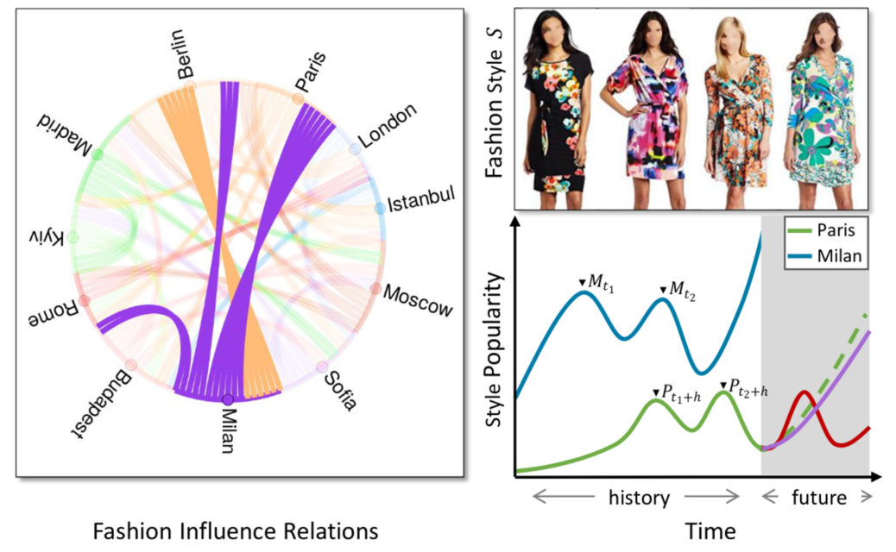

# From Paris to Berlin: Discovering Fashion Style Influences Around the World

Implementation for our work to model fashion influence relations among major cities around the world learned from a massive set of social media images.

This code repository contains our influence-based forecaster and several other baselines used in:

Z. Al-Halah and K. Grauman. From Paris to Berlin: Discovering Fashion Style Influences Around the World. CVPR 2020.

Project page: https://www.cs.utexas.edu/~ziad/fashion_influence.html

Paper: https://arxiv.org/abs/2004.01316

<p align="center">
  
</p>


## Citing our work
If you use this code in your research, please cite the following [paper](https://arxiv.org/abs/2004.01316):

```
@inproceedings{al-halah2020,
    author = {Ziad Al-Halah and Kristen Grauman},
    title = {{From Paris to Berlin: Discovering Fashion Style Influences Around the World}},
    year = {2020},
    booktitle = {IEEE Conference on Computer Vision and Pattern Recognition (CVPR)},
    month = {June},
    doi = {10.1109/cvpr42600.2020.01015}
    arxivId = {2004.01316}
}
```

## Installation

1. Clone this github repository.
    ```bash
    git clone https://github.com/ziadalh/cvpr20_city_influence.git
    cd cvpr20_city_influence
    ```

2. Install Dependencies
    ```bash
    conda create -n cityinfl python=3.6
    conda activate cityinfl
    pip3 install -r requirements.txt
    ```

## Data

Go to the [project page](https://www.cs.utexas.edu/~ziad/fashion_influence.html) and download the style trends used in this work


## Evaluate

Run the code by pointing to one of the trend files you downloaded in the previous step and to an output directory. Example:
```bash
python main.py --f_traj trends_styles50_cities44_deseasonalized.pkl --d_output outputs
```

At the end of training and testing the forecasting models, you'll see the forecast errors for each model arranged together in a table similar to table 1 in the paper.

